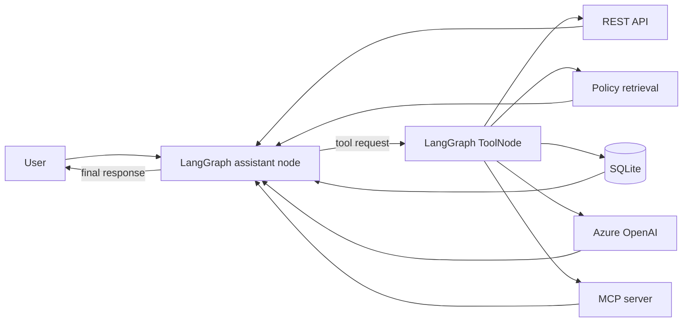

# ResolveFlow AI

An evolving customer-support agent built with LangChain, LangGraph, Azure
OpenAI, and the Model Context Protocol (MCP). The repository starts with a
small, understandable agent loop and documents the path toward a secure,
observable, production-grade service.

> Current stage: **Reliable application** - working CLI agent, five tool
> capabilities, thread-scoped conversation memory, automated tests, and
> continuous integration.

## Why this project is interview-worthy

ResolveFlow AI demonstrates more than a chatbot. It shows how an LLM can be
placed inside a controlled workflow and grounded in purpose-built tools:

- **Agent orchestration:** LangGraph routes between model decisions and tools.
- **Tool integration:** REST, retrieval, SQLite, a delegated LLM call, and MCP.
- **Grounded answers:** policy questions use a local knowledge source instead
  of relying on model memory.
- **Durable conversation memory:** LangGraph checkpoints state by thread ID in
  local SQLite, enabling contextual follow-ups across CLI restarts.
- **Safe data access:** order lookup uses a narrow, validated, parameterized
  query rather than unrestricted model-generated SQL.
- **Engineering evolution:** the [roadmap](ROADMAP.md) separates a learning
  prototype from the controls required in production.

## Architecture



The model selects a capability, LangGraph executes it, and the tool result is
returned to the model before it produces a grounded response.

## Quick start

Prerequisites: Python 3.11+ and access to an Azure OpenAI chat deployment.

```powershell
python -m venv .venv
.\.venv\Scripts\Activate.ps1
python -m pip install -r requirements.txt
Copy-Item .env.example .env
```

Fill in the three Azure values in `.env`, then run:

```powershell
python -m support_agent.agent --list-tools
python -m support_agent.agent
```

Run the same agent as an HTTP API:

```powershell
python -m uvicorn support_agent.api:app --reload
```

Run the React UI during development in a second terminal:

```powershell
cd frontend
npm.cmd install
npm.cmd run dev
```

Open `http://127.0.0.1:5173`. For a single-server production-style run, build
with `npm.cmd run build`, start FastAPI, and open `http://127.0.0.1:8000`.

Swagger UI is available at `http://127.0.0.1:8000/docs`. `POST /chat` accepts
`message`, `user_id`, and an optional `thread_id`; reuse the returned thread ID
for contextual follow-up questions. `POST /chat/stream` accepts the same body
and streams tool progress plus answer tokens as Server-Sent Events.

Inside the CLI, type `/new` to start a clean conversation. Use `--thread-id`
to choose an explicit session identifier. Reusing the same ID restores its
history from `support_agent/conversations.db`:

```powershell
python -m support_agent.agent --thread-id customer-101
```

Example prompts:

```text
Look up ORD-101 and tell me whether its product has a warranty.
Can an unused product be returned after 20 days?
What are the human support hours in India?
```

Run the offline test suite (no API key or network call required):

```powershell
python -m unittest discover -s tests -v
```

## Repository map

```text
support_agent/                  Main agent package
  agent.py                      LangGraph workflow and CLI
  api/
    app.py                      FastAPI factory, lifespan, and endpoints
    schemas.py                  Validated API request/response models
  local_tools.py                REST, retrieval, LLM, and database tools
  mcp_server.py                 Local MCP server over stdio
  knowledge_base.md             Example support policies
tests/                          Offline unit tests
frontend/                       React, TypeScript, and Vite chat UI
ROADMAP.md                      Prototype-to-production plan
```

For a detailed explanation of every capability and design tradeoff, see the
[support agent walkthrough](support_agent/README.md).

The current learning status, completed concepts, pending topics, and preferred
explain-before-implementation workflow are recorded in
[LEARNING_PROGRESS.md](LEARNING_PROGRESS.md).

## Security notes

- Secrets are loaded from `.env`, which is excluded from Git.
- `.env.example` contains placeholders only.
- Database access is read-only at the tool boundary and uses parameterized SQL.
- All included customer and order data is fictional demonstration data.

This is an educational foundation, not yet a production deployment. See the
[roadmap](ROADMAP.md) for the missing authentication, authorization,
observability, evaluation, resilience, and deployment controls.
