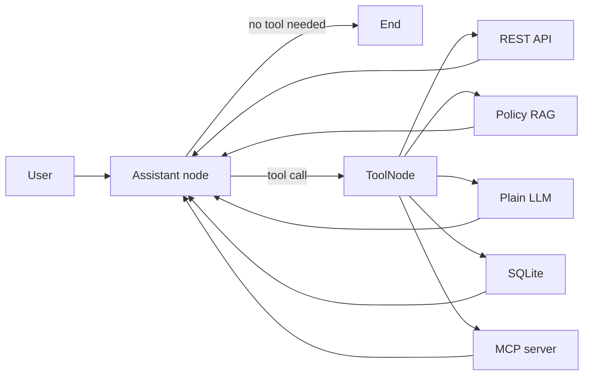

# Five-Capability LangChain and LangGraph Agent

This is a small educational customer-support agent using Azure OpenAI. It has
five capabilities:

1. REST API call
2. RAG retrieval call
3. Plain LLM call
4. SQLite database call
5. Local MCP server call

## Architecture



The important loop is:

```text
Model decides -> tool executes -> result enters state -> model decides again
```

The model may call one tool, several tools, or finish without another tool.
A SQLite checkpointer keeps message history for follow-up questions in the
same conversation thread, including after the CLI exits and restarts.

## Project files

```text
support_agent/
|-- agent.py            # Tool loading and LangGraph workflow
|-- config.py           # Azure OpenAI configuration
|-- local_tools.py      # API, RAG, LLM, and database tools
|-- mcp_server.py       # Separate MCP server process
|-- knowledge_base.md   # Documents searched by the RAG tool
|-- support.db          # Generated SQLite database (ignored by Git)
|-- conversations.db    # Generated conversation checkpoints (ignored by Git)
`-- README.md
```

The `api/` package adds an HTTP interface while leaving the existing CLI
available. `api/app.py` owns application lifecycle and routes, while
`api/schemas.py` owns the HTTP data contracts.

## Step 1: Configure Azure OpenAI

`config.py` loads the existing project-level `.env` file and creates an
unbound `ChatOpenAI` model.

Required variables:

```dotenv
AZURE_OPENAI_API_KEY=your-key
AZURE_OPENAI_ENDPOINT=https://your-resource.openai.azure.com
AZURE_OPENAI_DEPLOYMENT=your-deployment-name
```

Why: LangChain gives the rest of the program one standard chat-model
interface. Credentials stay outside source code.

Alternative: instantiate the Azure/OpenAI SDK directly, or use Microsoft Entra
ID instead of an API key.

Without it: tools that do not use the model can still run, but the agent cannot
choose tools or generate its final answer.

## Step 2: Create the four local tools

`local_tools.py` uses LangChain's `@tool` decorator. The decorator turns a
normal typed Python function and its docstring into a schema the model can
understand.

### REST API tool: `get_public_todo`

It performs an HTTP GET against JSONPlaceholder and returns a small normalized
JSON result.

Why: an LLM's training data cannot provide reliable live external state.

Alternative: use a provider SDK, call the API in a dedicated LangGraph node, or
place the API behind an MCP server.

Without it: the agent must refuse live API questions or risk inventing data.

### RAG tool: `search_support_policies`

It loads `knowledge_base.md`, separates policy sections, performs small lexical
retrieval, and returns the best passages. The agent's model then writes an
answer grounded in those passages.

Why: RAG supplies private or changing knowledge without retraining the model.

Alternative: use Azure OpenAI embeddings with FAISS/Chroma, Azure AI Search,
BM25, or another managed vector database.

Without it: the model does not know the example shop's authoritative return,
refund, shipping, or warranty policies and may hallucinate them.

This demo uses lexical retrieval because the current `.env` contains a chat
deployment but no separate embeddings deployment. It is intentionally basic;
production RAG should use better chunking, ranking, metadata filters, and
citations.

### Plain LLM tool: `answer_general_question`

It makes a second, unbound model call for a short general explanation.

Why: it makes the requested "normal LLM call" visible as a capability and
lets you see it in the printed `Tools used` list.

Alternative (usually preferred): let the assistant node answer general
questions directly. Wrapping one LLM inside another LLM's tool call increases
latency and cost, so this pattern is mainly educational.

Without it: this particular demo loses its explicit fifth branch, but the main
assistant model could still answer general questions directly.

### SQLite tool: `lookup_order`

It creates sample rows and uses a parameterized `SELECT` query for one order.

Why: databases are the source of truth for structured transactional data.

Alternative: use SQLAlchemy, a repository/service layer, LangChain's SQL tools,
or an internal service API.

Without it: the agent cannot answer customer/order questions reliably.

Do not give a production model unrestricted SQL access. Prefer narrow,
read-only functions, validate identity/authorization, and parameterize queries.

## Step 3: Create the MCP server

`mcp_server.py` runs separately over the MCP `stdio` transport. It exposes
`get_support_hours` using the official Python MCP SDK's `FastMCP` interface.

Why: MCP standardizes tool discovery and invocation. The agent does not need a
custom integration for every compatible external server.

Alternative: call the same function directly, expose it through REST, or run a
remote MCP server over Streamable HTTP.

Without it: the four local tools still work, but the agent loses the portable,
protocol-based integration and cannot discover that server's tool.

## Step 4: Convert MCP tools to LangChain tools

`agent.py` creates `MultiServerMCPClient` with this connection:

```text
transport = stdio
command   = current virtual-environment Python
args      = path to mcp_server.py
```

`client.get_tools()` starts the server, asks it to list tools, and converts the
MCP definitions into LangChain-compatible tools. The converted MCP tool can be
placed in the same list as local `@tool` functions.

Without the MCP adapter, you would have to manage subprocess messages, MCP
sessions, schemas, and result conversion manually.

## Step 5: Bind all tools to the model

`model.bind_tools(all_tools)` sends the tool names, descriptions, and argument
schemas to Azure OpenAI. The model does not execute Python itself; it returns a
structured tool-call request.

Why: tool calling lets the model select a capability and provide validated
arguments.

Alternative: write a deterministic router based on menus, keywords, or intent
classification. Deterministic routing is often better for strict workflows.

Without binding: the model cannot discover or request any of the tools.

## Step 6: Build the LangGraph loop

The graph uses these concepts:

### `MessagesState`

Stores the user message, model tool requests, tool results, and final answer in
order.

Alternative: define a custom `TypedDict` state with fields such as `customer`,
`documents`, `order`, and `errors`.

Without state: a later node would not see earlier tool results.

### Assistant node

Calls the tool-bound Azure model. It can either request tools or return a final
answer.

Alternative: separate router, planner, and response-generator nodes.

Without it: nothing interprets the question or synthesizes results.

### `ToolNode`

Executes whichever tool calls the model requested and appends results to
`MessagesState`.

Alternative: manually inspect every tool-call name and dispatch functions with
an `if/elif` block.

Without it: tool requests are produced but never executed.

### Conditional edge with `tools_condition`

After the assistant runs, this edge checks whether its message contains tool
calls. Tool calls go to `ToolNode`; a normal answer goes to `END`.

Alternative: implement a custom routing function.

Without it: the workflow cannot decide whether to execute a tool or finish.

### Edge from tools back to assistant

This creates the agent loop. The model receives tool results and can combine
them, request another tool, or finish.

Alternative: use a fixed one-tool pipeline.

Without the return edge: the tool may run, but the model never sees its result
and cannot produce the final response.

## Step 7: Add short-term conversation memory

By default, `agent.py` opens an `AsyncSqliteSaver` and passes it when compiling
the graph:

```text
builder.compile(checkpointer=checkpointer)
```

Every invocation also includes a configurable `thread_id`. LangGraph loads the
previous `MessagesState` for that thread before running the next turn and saves
the updated state after graph steps.

Why: follow-up questions can refer to earlier messages without repeating all
details. For example:

```text
You: Look up order ORD-101.
You: Does its product have a warranty?
```

Why the async saver: the graph uses `ainvoke()`, so the saver can perform
checkpoint I/O without blocking the event loop.

Alternative: use `InMemorySaver` for temporary demos, or Postgres/Azure Cosmos
DB for a production service shared by multiple application instances.

Without it: each `ainvoke()` starts from an empty state, so words such as "it",
"that order", or "the previous result" have no conversation context.

The default database is `support_agent/conversations.db`. History is separated
by `thread_id`, so the same ID restores the same conversation while a different
ID starts an isolated conversation. Type `/new` to switch to a new ID; this
does not delete the old conversation.

## Step 8: Install and run

From the project root in PowerShell:

```powershell
.\.venv\Scripts\python.exe -m pip install -r requirements.txt
.\.venv\Scripts\python.exe -m support_agent.agent --list-tools
.\.venv\Scripts\python.exe -m support_agent.agent
```

Optionally choose the conversation thread:

```powershell
.\.venv\Scripts\python.exe -m support_agent.agent --thread-id customer-101
```

To verify persistence, run the command above, ask a question, and exit. Open a
second terminal and run the exact same command. A follow-up question can use
the earlier context because both processes use the same thread ID and SQLite
file. Use a different ID when conversations must be isolated.

Optional memory controls:

```powershell
# Choose another checkpoint file.
.\.venv\Scripts\python.exe -m support_agent.agent --thread-id customer-101 --memory-db .\data\chat.db

# Restore the original process-local behavior for a temporary demo.
.\.venv\Scripts\python.exe -m support_agent.agent --thread-id customer-101 --in-memory
```

SQLite is suitable for this local learning project. Avoid simultaneous writes
to the same thread from multiple terminals. A multi-user production service
should use a production checkpointer such as Postgres and serialize concurrent
requests for each thread.

Useful prompts:

```text
Fetch sample API todo 1.
Can an unused product be returned after 20 days?
Use the general-question tool to explain an API.
Look up order ORD-101.
What are the human support hours in India?
```

Multi-tool prompt:

```text
Look up ORD-101 and tell me whether its product has a warranty.
```

The CLI prints `Tools used` so you can inspect the model's routing decision.

## Step 9: Expose the existing agent through FastAPI

`api/app.py` wraps the same compiled LangGraph agent in three HTTP endpoints:

```text
GET  /health   -> confirms that the service started
POST /chat     -> sends one message to the agent
POST /chat/stream -> streams one agent run using Server-Sent Events
```

Start the web service from the project root:

```powershell
python -m uvicorn support_agent.api:app --reload
```

If your terminal is already inside the `support_agent` folder, use:

```powershell
python -m uvicorn api:app --reload
```

Then open `http://127.0.0.1:8000/docs` for Swagger UI, or send a request from
PowerShell:

```powershell
$body = @{
    message = "Look up ORD-101 and explain its warranty"
    user_id = "customer-101"
    thread_id = "order-help"
} | ConvertTo-Json

Invoke-RestMethod `
    -Method Post `
    -Uri "http://127.0.0.1:8000/chat" `
    -ContentType "application/json" `
    -Body $body
```

The response has a stable shape:

```json
{
  "answer": "...",
  "user_id": "customer-101",
  "thread_id": "order-help",
  "tools_used": ["lookup_order", "search_support_policies"]
}
```

### Concepts used in the API

**Pydantic request and response models:** validate lengths, reject unknown
fields, and generate the OpenAPI/Swagger schema automatically. An alternative
is manual dictionary validation; without validation, malformed input reaches
the agent and API clients cannot rely on a stable contract.

**FastAPI lifespan:** creates the model, MCP tools, graph, and SQLite saver once
at application startup, and closes the saver during shutdown. An alternative
is creating them inside every request; without shared startup initialization,
every message repeats expensive setup and resource cleanup becomes unreliable.

**User-scoped thread key:** the API stores memory under an internal key such as
`user:customer-101:thread:order-help`. This prevents two different users who
choose the same public `thread_id` from accidentally sharing history. A random
ID alone is an alternative; without namespacing, identifier collisions can mix
conversations. The supplied `user_id` is educational only and is not
authentication.

**Per-thread async lock:** requests for different conversations may run
concurrently, but two simultaneous requests for the same thread are processed
in order. An alternative is queueing requests in Redis or a database-backed
worker. Without ordering, concurrent checkpoints may branch from the same old
state or overwrite the expected conversational sequence.

**Dependency injection for tests:** `create_app()` can receive a fake agent, so
endpoint validation and routing tests do not call Azure OpenAI. An alternative
is overriding FastAPI dependencies. Without a test seam, basic API tests become
slow, costly, and network-dependent.

If `thread_id` is omitted, the API generates one and returns it. The client must
send that returned ID on later messages to continue the conversation.

## Step 10: Stream tokens and tool progress

`POST /chat/stream` accepts the same JSON body as `/chat`, but keeps the HTTP
connection open and returns Server-Sent Events as the graph executes. Test it
with `curl.exe`; `-N` disables output buffering:

```powershell
curl.exe -N -X POST "http://127.0.0.1:8000/chat/stream" `
  -H "Content-Type: application/json" `
  -d '{"message":"Look up ORD-101 and explain its warranty","user_id":"customer-101","thread_id":"stream-demo"}'
```

The event sequence looks like:

```text
event: session
data: {"user_id":"customer-101","thread_id":"stream-demo"}

event: tool_start
data: {"name":"lookup_order"}

event: tool_end
data: {"name":"lookup_order"}

event: token
data: {"text":"Your"}

event: done
data: {"tools_used":["lookup_order"]}
```

**LangGraph event streaming:** `astream_events()` exposes model-token and tool
lifecycle events while the same graph runs and saves checkpoints. Without it,
the API sees only the final graph state and cannot report live progress.

**Server-Sent Events:** SSE uses a normal one-way HTTP response and named text
events, making it simpler than WebSockets for server-to-browser token output.
The alternative is WebSockets, which are preferable when the server and client
must both send messages continuously.

**StreamingResponse:** FastAPI sends each generated SSE block immediately
instead of buffering the complete answer. Without a streaming response, the
client receives all events together after the agent finishes.

**Disconnect handling:** if the browser closes the connection, cancellation is
propagated instead of keeping abandoned work alive unnecessarily.

Only main `assistant` node tokens are sent. Tokens generated internally by the
`answer_general_question` tool are filtered out, preventing duplicated or
partially composed output. Errors that happen after streaming begins arrive as
an `error` SSE event because the HTTP status has already been sent.

## Step 11: React chat interface

The `frontend/` directory contains a React, TypeScript, and Vite single-page
chat UI. It reads the POST SSE response with Fetch `ReadableStream`, displays
tool progress, appends answer tokens, persists the browser session, and can
cancel generation with `AbortController`.

Development uses two terminals:

```powershell
# Terminal 1, project root
python -m uvicorn support_agent.api:app --reload

# Terminal 2
cd frontend
npm.cmd install
npm.cmd run dev
```

Open `http://127.0.0.1:5173`. To serve everything from FastAPI, run
`npm.cmd run build`, restart FastAPI, and open `http://127.0.0.1:8000`.

Vite proxies `/chat` and `/health` during development, avoiding CORS. In a
production build, FastAPI serves `frontend/dist` at `/`, so the UI and API use
the same origin. The UI's `user_id` remains a demo identifier, not secure
authentication.

## What this basic example deliberately omits

- Production-grade distributed conversation storage and retention controls
- Real authentication; the current `user_id` is supplied by the caller
- Human approval for write operations
- Production embeddings/vector search
- RAG citations and confidence thresholds
- Retry policies and circuit breakers around every external dependency
- Observability, evaluation datasets, and automated safety tests

Those are the next production-hardening steps after the basic loop is clear.
