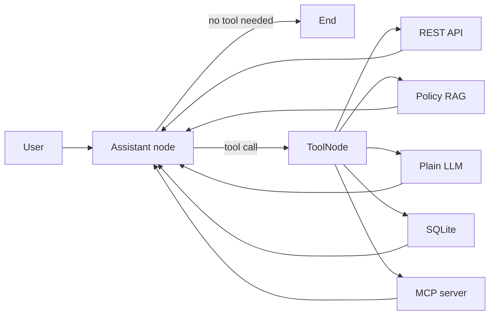

# Five-Capability LangChain and LangGraph Agent

This is a small educational customer-support agent using Azure OpenAI. It has
five capabilities:

1. REST API call
2. RAG retrieval call
3. Plain LLM call
4. SQLite database call
5. Local MCP server call

## Architecture



The important loop is:

```text
Model decides -> tool executes -> result enters state -> model decides again
```

The model may call one tool, several tools, or finish without another tool.

## Project files

```text
support_agent/
|-- agent.py            # Tool loading and LangGraph workflow
|-- config.py           # Azure OpenAI configuration
|-- local_tools.py      # API, RAG, LLM, and database tools
|-- mcp_server.py       # Separate MCP server process
|-- knowledge_base.md   # Documents searched by the RAG tool
|-- support.db          # Generated SQLite database (ignored by Git)
`-- README.md
```

## Step 1: Configure Azure OpenAI

`config.py` loads the existing project-level `.env` file and creates an
unbound `ChatOpenAI` model.

Required variables:

```dotenv
AZURE_OPENAI_API_KEY=your-key
AZURE_OPENAI_ENDPOINT=https://your-resource.openai.azure.com
AZURE_OPENAI_DEPLOYMENT=your-deployment-name
```

Why: LangChain gives the rest of the program one standard chat-model
interface. Credentials stay outside source code.

Alternative: instantiate the Azure/OpenAI SDK directly, or use Microsoft Entra
ID instead of an API key.

Without it: tools that do not use the model can still run, but the agent cannot
choose tools or generate its final answer.

## Step 2: Create the four local tools

`local_tools.py` uses LangChain's `@tool` decorator. The decorator turns a
normal typed Python function and its docstring into a schema the model can
understand.

### REST API tool: `get_public_todo`

It performs an HTTP GET against JSONPlaceholder and returns a small normalized
JSON result.

Why: an LLM's training data cannot provide reliable live external state.

Alternative: use a provider SDK, call the API in a dedicated LangGraph node, or
place the API behind an MCP server.

Without it: the agent must refuse live API questions or risk inventing data.

### RAG tool: `search_support_policies`

It loads `knowledge_base.md`, separates policy sections, performs small lexical
retrieval, and returns the best passages. The agent's model then writes an
answer grounded in those passages.

Why: RAG supplies private or changing knowledge without retraining the model.

Alternative: use Azure OpenAI embeddings with FAISS/Chroma, Azure AI Search,
BM25, or another managed vector database.

Without it: the model does not know the example shop's authoritative return,
refund, shipping, or warranty policies and may hallucinate them.

This demo uses lexical retrieval because the current `.env` contains a chat
deployment but no separate embeddings deployment. It is intentionally basic;
production RAG should use better chunking, ranking, metadata filters, and
citations.

### Plain LLM tool: `answer_general_question`

It makes a second, unbound model call for a short general explanation.

Why: it makes the requested "normal LLM call" visible as a capability and
lets you see it in the printed `Tools used` list.

Alternative (usually preferred): let the assistant node answer general
questions directly. Wrapping one LLM inside another LLM's tool call increases
latency and cost, so this pattern is mainly educational.

Without it: this particular demo loses its explicit fifth branch, but the main
assistant model could still answer general questions directly.

### SQLite tool: `lookup_order`

It creates sample rows and uses a parameterized `SELECT` query for one order.

Why: databases are the source of truth for structured transactional data.

Alternative: use SQLAlchemy, a repository/service layer, LangChain's SQL tools,
or an internal service API.

Without it: the agent cannot answer customer/order questions reliably.

Do not give a production model unrestricted SQL access. Prefer narrow,
read-only functions, validate identity/authorization, and parameterize queries.

## Step 3: Create the MCP server

`mcp_server.py` runs separately over the MCP `stdio` transport. It exposes
`get_support_hours` using the official Python MCP SDK's `FastMCP` interface.

Why: MCP standardizes tool discovery and invocation. The agent does not need a
custom integration for every compatible external server.

Alternative: call the same function directly, expose it through REST, or run a
remote MCP server over Streamable HTTP.

Without it: the four local tools still work, but the agent loses the portable,
protocol-based integration and cannot discover that server's tool.

## Step 4: Convert MCP tools to LangChain tools

`agent.py` creates `MultiServerMCPClient` with this connection:

```text
transport = stdio
command   = current virtual-environment Python
args      = path to mcp_server.py
```

`client.get_tools()` starts the server, asks it to list tools, and converts the
MCP definitions into LangChain-compatible tools. The converted MCP tool can be
placed in the same list as local `@tool` functions.

Without the MCP adapter, you would have to manage subprocess messages, MCP
sessions, schemas, and result conversion manually.

## Step 5: Bind all tools to the model

`model.bind_tools(all_tools)` sends the tool names, descriptions, and argument
schemas to Azure OpenAI. The model does not execute Python itself; it returns a
structured tool-call request.

Why: tool calling lets the model select a capability and provide validated
arguments.

Alternative: write a deterministic router based on menus, keywords, or intent
classification. Deterministic routing is often better for strict workflows.

Without binding: the model cannot discover or request any of the tools.

## Step 6: Build the LangGraph loop

The graph uses these concepts:

### `MessagesState`

Stores the user message, model tool requests, tool results, and final answer in
order.

Alternative: define a custom `TypedDict` state with fields such as `customer`,
`documents`, `order`, and `errors`.

Without state: a later node would not see earlier tool results.

### Assistant node

Calls the tool-bound Azure model. It can either request tools or return a final
answer.

Alternative: separate router, planner, and response-generator nodes.

Without it: nothing interprets the question or synthesizes results.

### `ToolNode`

Executes whichever tool calls the model requested and appends results to
`MessagesState`.

Alternative: manually inspect every tool-call name and dispatch functions with
an `if/elif` block.

Without it: tool requests are produced but never executed.

### Conditional edge with `tools_condition`

After the assistant runs, this edge checks whether its message contains tool
calls. Tool calls go to `ToolNode`; a normal answer goes to `END`.

Alternative: implement a custom routing function.

Without it: the workflow cannot decide whether to execute a tool or finish.

### Edge from tools back to assistant

This creates the agent loop. The model receives tool results and can combine
them, request another tool, or finish.

Alternative: use a fixed one-tool pipeline.

Without the return edge: the tool may run, but the model never sees its result
and cannot produce the final response.

## Step 7: Install and run

From the project root in PowerShell:

```powershell
.\.venv\Scripts\python.exe -m pip install -r requirements.txt
.\.venv\Scripts\python.exe -m support_agent.agent --list-tools
.\.venv\Scripts\python.exe -m support_agent.agent
```

Useful prompts:

```text
Fetch sample API todo 1.
Can an unused product be returned after 20 days?
Use the general-question tool to explain an API.
Look up order ORD-101.
What are the human support hours in India?
```

Multi-tool prompt:

```text
Look up ORD-101 and tell me whether its product has a warranty.
```

The CLI prints `Tools used` so you can inspect the model's routing decision.

## What this basic example deliberately omits

- Authentication and per-customer authorization
- Conversation persistence/checkpointing
- Human approval for write operations
- Production embeddings/vector search
- RAG citations and confidence thresholds
- Retry policies and circuit breakers around every external dependency
- Observability, evaluation datasets, and automated safety tests

Those are the next production-hardening steps after the basic loop is clear.
